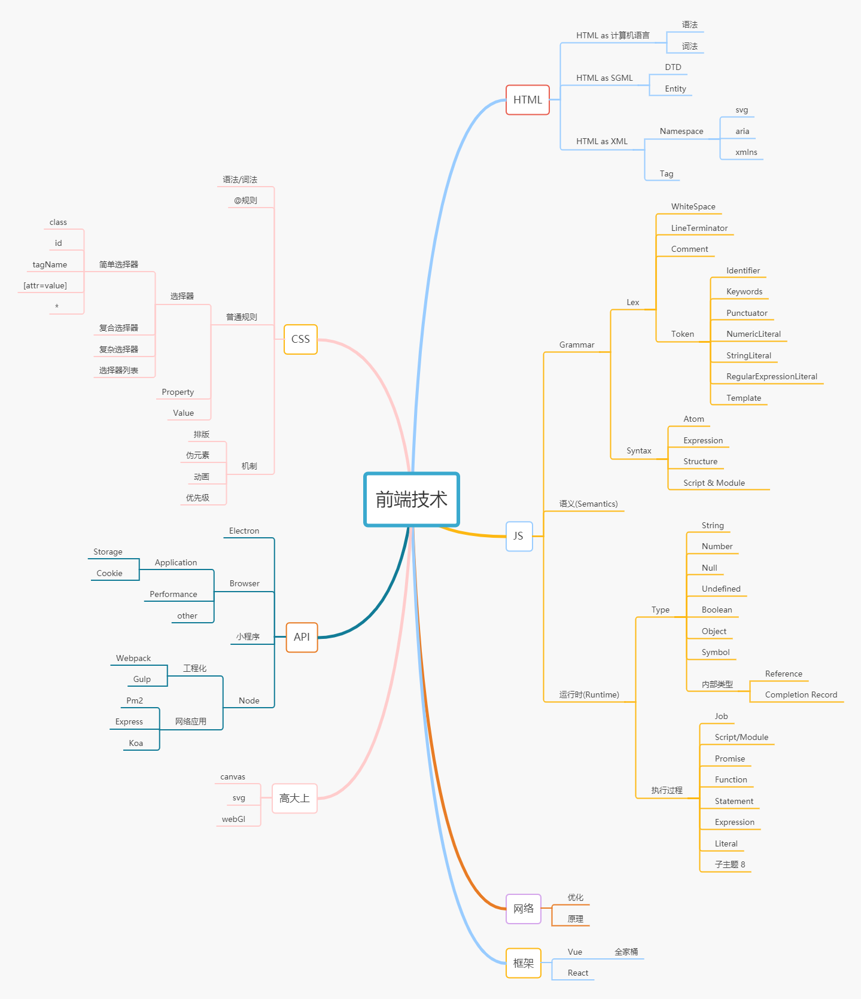

# 每周总结可以写在这里

随堂作业
1. 解析URL
 window.location 内置了分析链接的方法
 可以自己实现一个方法解析链接
 ```javascript
module.exports = 
function customDecode(url = window.location.href) {
    // 防御判断
    if(typeof url !== 'string') {
        throw Error('type need string')
    }    
    let result = {}
    // 转义中文路径
    result.href = decodeURI(url)
    // 查询参数
    result.query = deQuery(url)
    // 锚点
    result.hash = decodeURIComponent(ret(/(?<=#).*/, url))
    // 
    result.hostname = ret(/(?<=\/{2}).*?(?=[:|\/])/, url)
    // 路径
    result.pathname =  '/' + ret(/(?<=:\/{2}.*\/).*?(?=\?|#|$)/, url)
    // 查询的完全体，原生上有就带上了
    result.search = ret(/\?.*(?=#)/, url)
    // 端口
    result.port = ret(/(?<=:)[0-9]+[$]?/,url)
    // 协议
    result.protocol = ret(/.*(?=\/{2})/,url)
    return result
}

function ret(reg, url = window.location.href) {
    return reg.exec(url)?
        reg.exec(url)[0]: ''
}

function deQuery(url = window.location.href) {
    let result = {}
    let query = /(?<=\?).*=.*?&?(?=#|$)/.exec(url)
    if(query) {
        query[0].split('&').map((item) => {
            return item.split('=')
        }).forEach((item) => {
            result[item[0]] = item[1]
        })
    }

    return result
}
```
原理： 正则处理字符串链接，根据一般经验提取内容

测试: https://u.geekbang.org/lesson/12?article=223397#hash666


### 知识体系


### 学习总结
前端知识可以分为三大能力，编程能力，架构能力，工程能力。
不只是做页面才叫做前端工程师。面向用户的都叫做前端。
细分之下，页面只是前端的一小部分，以前的思想过于狭隘。
比如前端还有游戏开发的领域，能力比之页面开发应该会强不少。

若设计一个功能，应先考虑好最后PPT的问题，成果的好坏最后还要PPT来拉分，
面试小吹，晋升大吹。吹成血赚，吹破不亏。